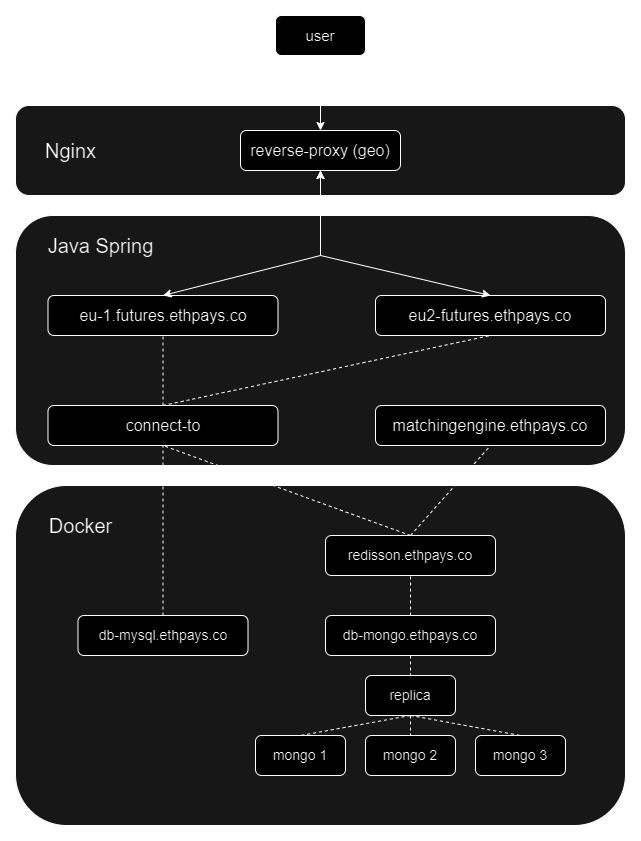
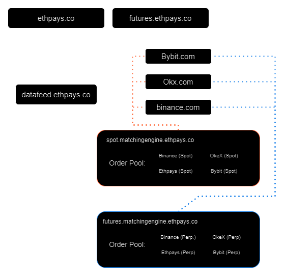
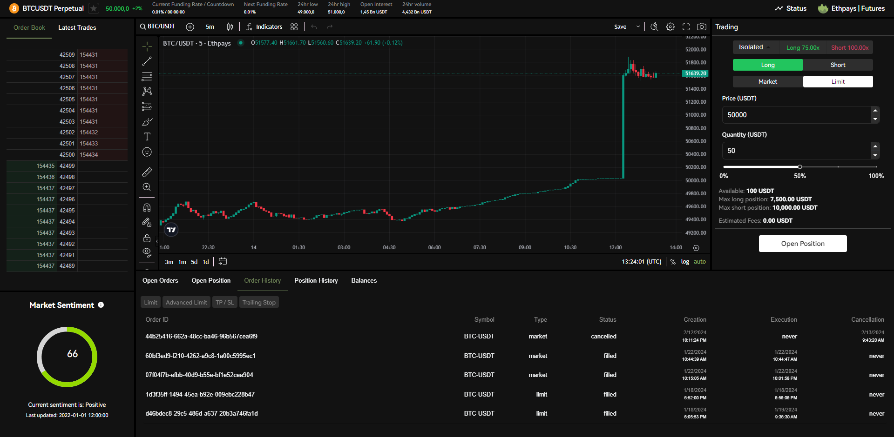
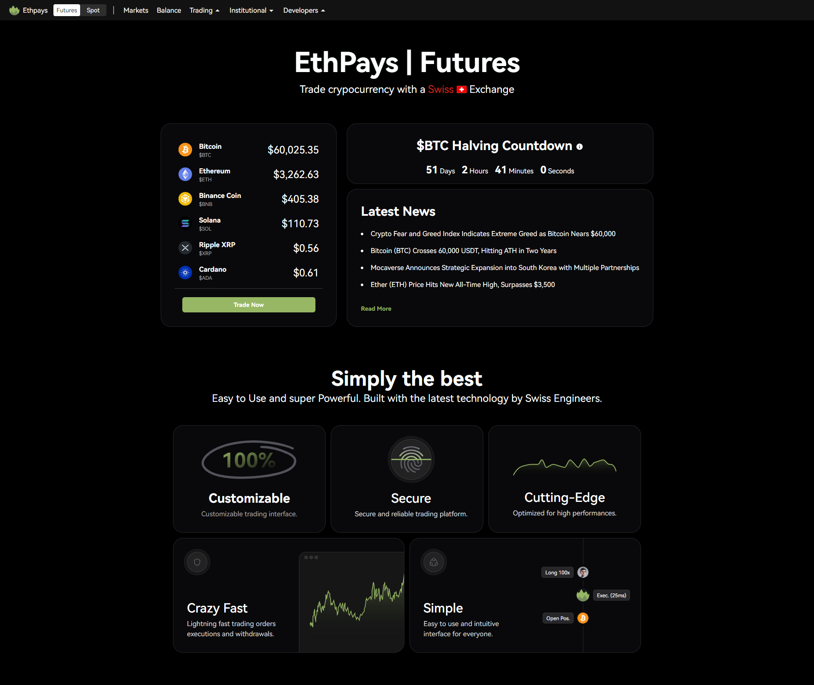
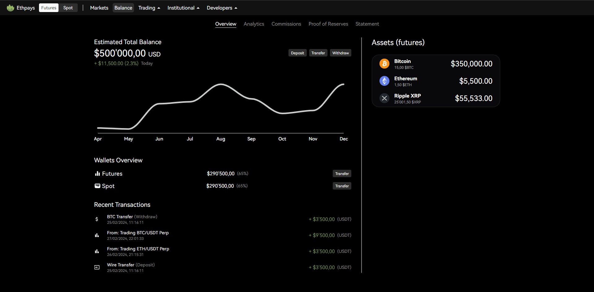

# Ethpays Public Repository

Welcome to the public repository for Ethpays! This repository serves as a central hub for sharing information and updates about our exchange platform. While some of the information provided here may not be finalized or ready for publication, we believe in transparency and want to keep our community informed about our development progress.

## About Ethpays

Ethpays is a cutting-edge cryptocurrency exchange platform committed to providing a secure, efficient, and user-friendly trading experience for our customers. Our platform is designed to facilitate the seamless exchange of various cryptocurrencies while prioritizing security and customer satisfaction.

## What You'll Find in This Repository

- **Project Updates:** Stay up-to-date with the latest developments, feature enhancements, and upcoming releases.
- **Documentation:** Access documentation related to API usage, trading guidelines, and platform functionalities.
- **Feedback and Suggestions:** We welcome feedback and suggestions from our community. Feel free to submit your ideas or report any issues you encounter.

## Getting Started

While this repository primarily serves as a resource for sharing information, you can get involved and contribute in the following ways:

- **Issues:** If you encounter any bugs or have suggestions for improvement, please submit an issue. Be sure to provide detailed information to help us address your concerns effectively.
- **Pull Requests:** We appreciate contributions from the community. If you have code improvements, feature enhancements, or documentation updates, submit a pull request, and we'll review it accordingly.

## Diagrams

### Futures | Ethpays
 

### MatchingEngine | Ethpays
 

## Sneak Peeks

### Futures Frontend
 
 
 

## Disclaimer

Please note that the information provided in this repository may be subject to change, and some features or functionalities mentioned here may not be available or finalized. We encourage you to refer to our official website and communication channels for the latest updates and announcements regarding Ethpays.
